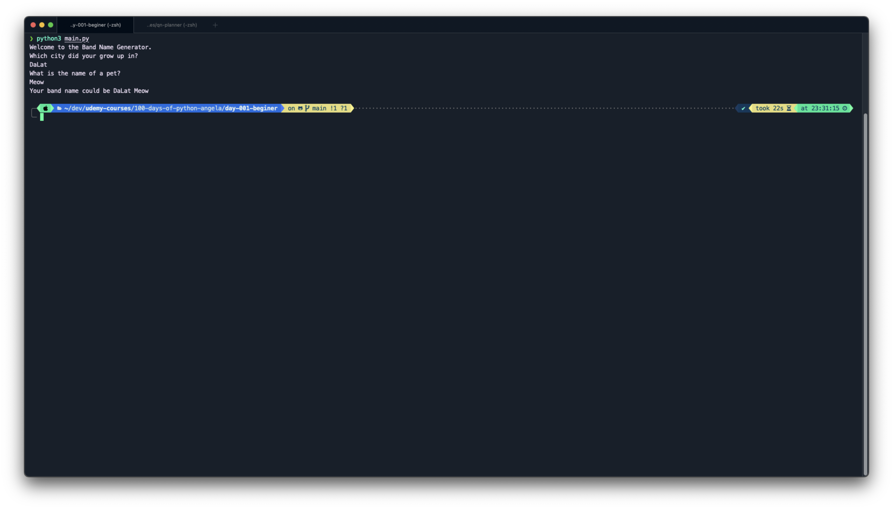
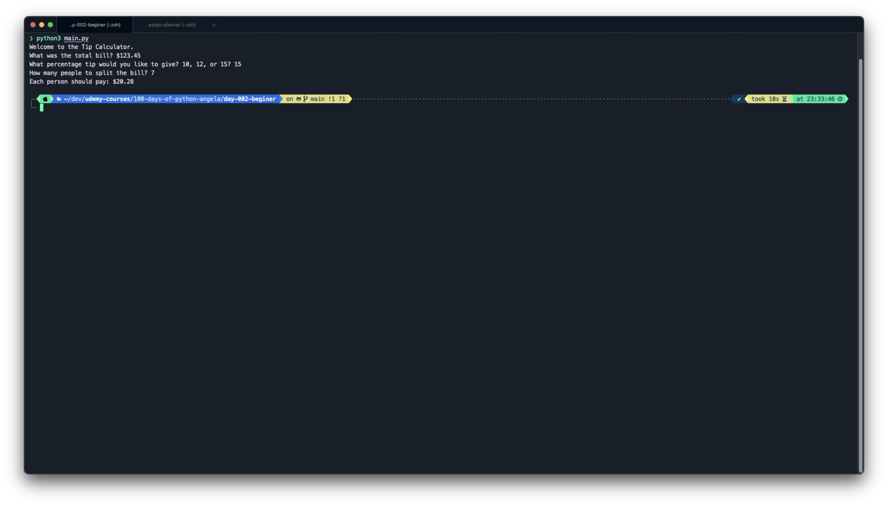

# 100 Days of Code: The Complete Python Pro Bootcamp for 2023

- [100 Days of Code: The Complete Python Pro Bootcamp for 2023](#100-days-of-code-the-complete-python-pro-bootcamp-for-2023)
  - [Tools](#tools)
  - [1. Day 1 - Beginner - Working with Variables in Python to Manage data](#1-day-1---beginner---working-with-variables-in-python-to-manage-data)
  - [2. Day 2 - Beginner - Understanding data types and how to manipulate strings](#2-day-2---beginner---understanding-data-types-and-how-to-manipulate-strings)

## Tools

- Phonny: execute code step-by-step

## 1. Day 1 - Beginner - Working with Variables in Python to Manage data

Goals:

- Printing
- Commenting
- Debugging
- String manipulation
- Variables
- Project: Band name generator

[Note](day-001-beginner/README.md)

[Source](day-001-beginner/main.py)

## 2. Day 2 - Beginner - Understanding data types and how to manipulate strings

Goals:

- Primitive data types
- Type error, type checking and type conversion
- Mathematical operations in Python
- Number manipulation
- f-string
- Format function
- Project: Tip Calculator

[Note](day-002-beginner/README.md)

[Source](day-002-beginner/main.py)

